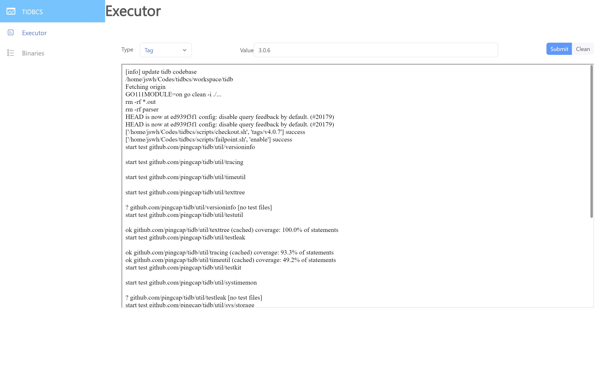
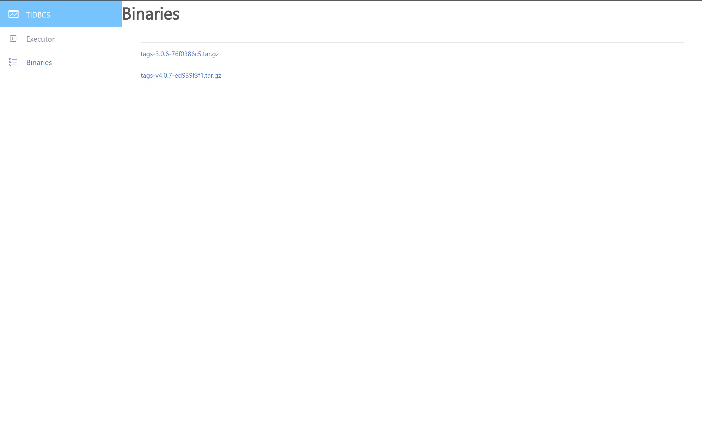

# This is a small ci project for tidb
## Startup(dev enviroment)
1. setup python enviroment
2. install python packages in `api/requirements` with command  `pip install -r api/requirements`
3. run api service with command `FLASK_APP=api/app.py flask run`
4. run frontend service with command `cd app && yarn start` in another shell window

## Startup(production enviroment)
TODO

## TODO
[] use shared config

